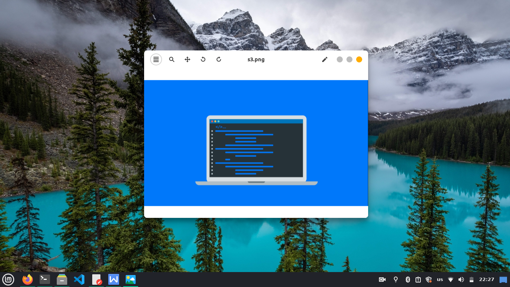
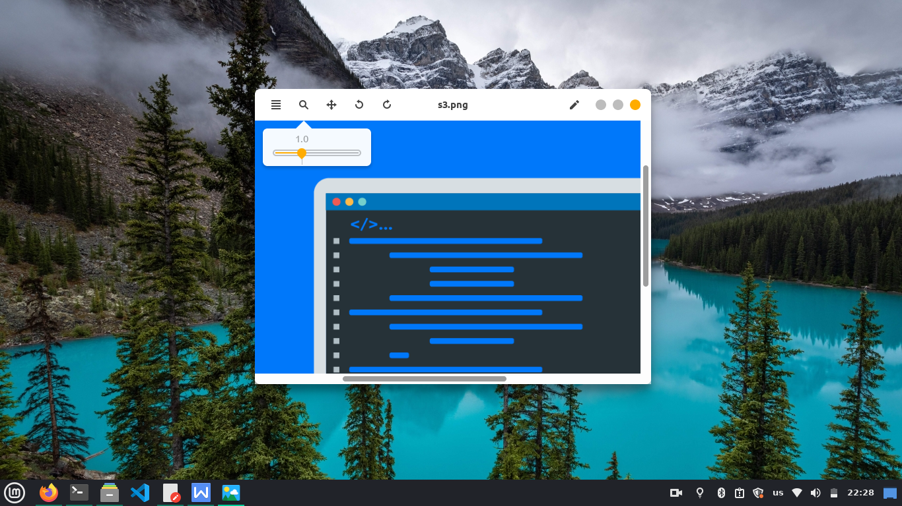
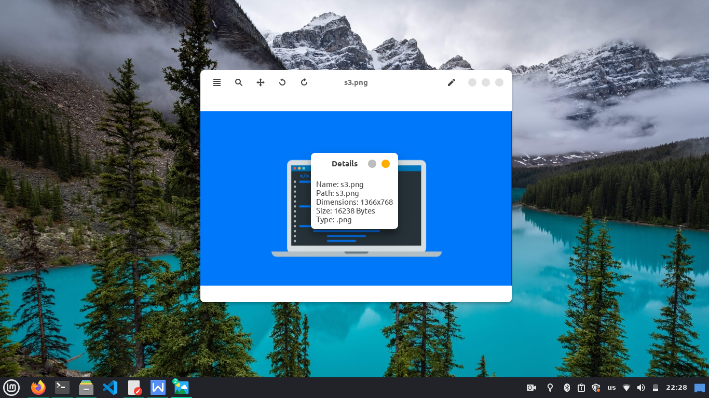
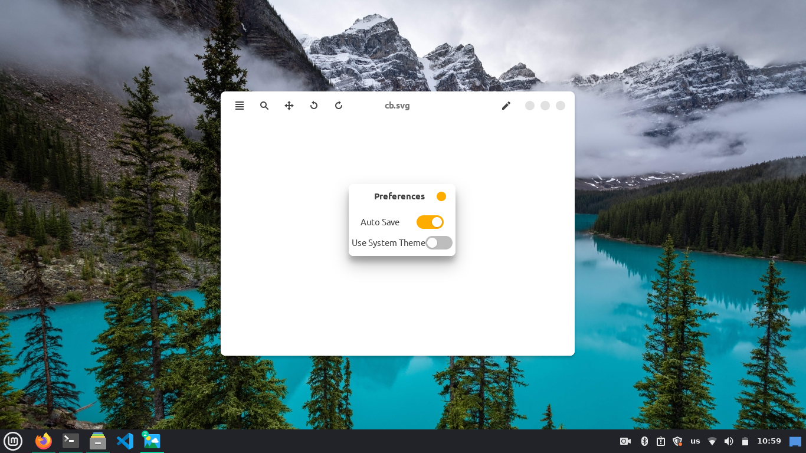
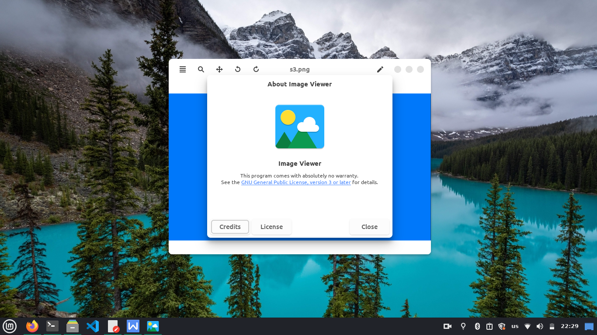

# LinuxImageViewer
A powerful and modern ImageViewer for linux based on Gtk and Cairo

# Dependencies
Before compiling make sure that the following packages are installed on your system:
- g++
- libgtkmm-3.0-dev

Note: Package names may differ according to your linux distro

# Building from source
To build this app from source , run the following:
```
git clone https://github.com/hamza-Algohary/LinuxImageViewer
cd LinuxImageViewer
g++ main.cpp `pkg-config gtkmm-3.0 --libs --cflags` -lstdc++fs text_editor.cpp
```
# Screenshots






